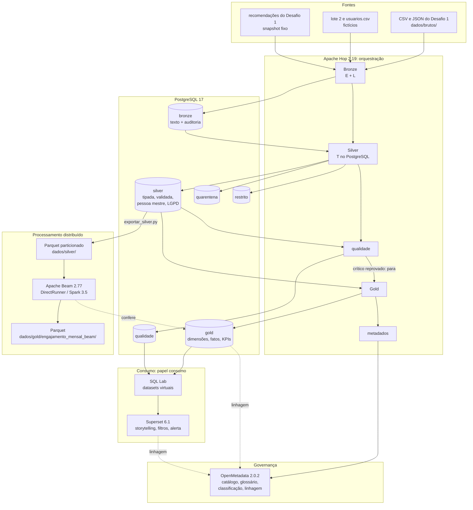

# Arquitetura do Desafio 2 (RF19)

A solução do Desafio 1 era um script Python que lia os arquivos, validava, gravava e calculava tudo numa execução só. O Desafio 2 transforma esse fluxo numa plataforma em camadas, orquestrada, governada e auditável. O Desafio 1 continua funcionando e passa a ser uma das **fontes**.

Tudo roda em Docker Compose (Linux, macOS Intel e Apple Silicon, Windows com WSL2), sem instalar nada além do Docker.

## Fluxo de ponta a ponta



## Onde acontecem extração, transformação e carga

| Etapa | E / T / L | Ferramenta | O que faz |
| --- | --- | --- | --- |
| Fontes → Bronze | **E + L** | Hop (`bronze_*.hpl`) | lê CSV e JSON e grava como texto, sem transformar, com `_execucao_id`, `_origem`, `_linha` e `_ingerido_em`; append-only |
| Bronze → Silver | **T** | SQL no PostgreSQL (`validacao.classificar_*`), roteado pelo Hop (`silver_*.hpl`) | tipagem, padronização, validação, deduplicação, dados mestres e proteção LGPD; rejeitados → quarentena; publicação atômica |
| Silver → qualidade | **T** (verificação) | SQL (`qualidade.executar`) | 7 testes; um crítico reprovado bloqueia a Gold |
| Silver → Gold | **T** | SQL (`gold.publicar`) | dimensões, fatos e KPIs, numa transação |
| Silver → Parquet → Beam | **E**, **T**, **L** | `exportar_silver.py` + Apache Beam | extrai a Silver, transforma fora do banco (Beam) e carrega em Parquet |
| Gold → Superset | consumo | SQL Lab e Superset, papel `consumo` | consultas, datasets virtuais, dashboards e alerta |
| todas → OpenMetadata | metadados | ingestões do OpenMetadata, disparadas pelo Hop | catálogo e linhagem atualizados a cada execução |

## Classificação: ELT no fluxo principal, arquitetura híbrida no todo

- **Fluxo principal: ELT.** O dado é extraído e carregado bruto na Bronze. Toda transformação acontece depois, dentro do PostgreSQL, em SQL versionado, e o Hop só orquestra e roteia.
- **Ramo analítico: ETL.** O Beam extrai a Silver para Parquet, transforma fora do banco e carrega o resultado em arquivos. Esse ramo existe para o processamento distribuído (RF24, RF25) e é conferido contra a Gold.

Por isso a arquitetura é **híbrida**, com o ELT como espinha dorsal.

### Justificativa

| Critério | Por que ELT no fluxo principal |
| --- | --- |
| **Governança** | a Bronze guarda o dado original de toda execução, e cada linha sabe de onde veio (arquivo, linha, execução). Qualquer número do dashboard pode ser rastreado até a linha da fonte ([`linhagem.md`](linhagem.md)). As regras estão num lugar só (`sql/silver.sql`), versionadas e legíveis |
| **Reprocessamento** | corrigir uma regra ou um registro da quarentena e reprocessar a Silver não exige reler a fonte: a Bronze da execução está lá. A quarentena tem identidade estável, e a correção substitui o registro da Bronze na próxima Silver |
| **Desempenho** | as regras que cruzam fontes (o usuário existe? a interação é anterior à publicação?) são junções que o banco resolve de uma vez. Num ETL no Hop, cada verificação seria um lookup linha a linha na memória da ferramenta |
| **Custo** | um único PostgreSQL faz o armazenamento e a transformação. Não há outro motor para operar no fluxo principal, e o volume, milhares de registros por lote, cabe folgado nele |
| **Consistência** | a Silver e a Gold são publicadas em transações únicas. Quem consulta vê a versão anterior inteira ou a nova inteira, nunca uma carga parcial (RF23) |

| Critério | Por que ETL no ramo Beam |
| --- | --- |
| **Escala** | o dia em que o volume de interações não couber num banco relacional, o cálculo mensal já existe em Beam, sobre Parquet, e roda num cluster Spark sem mudar o código (RF25) |
| **Custo de leitura** | o Parquet particionado por mês lê só o mês e as colunas pedidos: 13 vezes mais rápido que o JSON e 5 vezes mais que o CSV no volume de 200 mil ([`parquet_beam.md`](parquet_beam.md)) |
| **Sem divergência** | o resultado do Beam é comparado com a Gold a cada execução (`igual_a_gold`) |

### Limitações da solução anterior (Desafio 1, scripts isolados)

| No Desafio 1 | Consequência | No Desafio 2 |
| --- | --- | --- |
| o dado bruto não era guardado; o script lia, tratava e gravava o resultado | não dava para auditar nem reprocessar sem a fonte original | Bronze append-only, com auditoria por linha |
| um único script, sem etapas registradas | uma falha no meio só aparecia no log; não se sabia o que tinha rodado | `controle.execucao` e `controle.etapa`, com início, fim, contagens e status de cada etapa; execução isolada de uma etapa |
| rejeitados num arquivo JSON | não havia como corrigir e reprocessar um registro | quarentena com ciclo pendente → corrigido → reprocessado, ou descartado |
| carga direto nas tabelas finais | uma falha no meio deixava os bancos parcialmente atualizados | preparo + publicação atômica |
| nenhum teste de qualidade separado da validação | um lote ruim chegava ao dashboard | 7 testes; crítico reprovado bloqueia a Gold |
| sem catálogo nem linhagem | o significado dos KPIs estava só na documentação | OpenMetadata com glossário, donos, classificação e linhagem |
| sem fonte de usuários; nenhuma proteção de dado pessoal | — | cadastro fictício, pseudonimização, hash com salt, mascaramento, papel `consumo` |
| execução manual | — | agendamento nativo do Hop (`hop-agendador`) |

## Componentes e versões (RF15)

| Componente | Versão | Imagem | Perfil do Compose |
| --- | --- | --- | --- |
| PostgreSQL + pgvector | 17 + 0.8 | `pgvector/pgvector:pg17` | base |
| MongoDB (Desafio 1) | 8.2 | `mongo:8.2` | base |
| Apache Superset | 6.1.0 | `desafio-superset` (Dockerfile próprio) | base |
| Redis, Mailpit (alertas) | 7.4, 1.31.3 | `redis:7.4-alpine`, `axllent/mailpit:v1.31.3` | `alertas` |
| Apache Hop | 2.19.0 | `apache/hop`, `apache/hop-web` | `pipeline`, `hop`, `agendamento` |
| Apache Beam (SDK Python e job server) | 2.77.0 | `apache/beam_python3.12_sdk` (+ psycopg), `apache/beam_spark3_job_server` | `pipeline`, `beam` |
| Apache Spark | 3.5.0 | `apache/spark:3.5.0-scala2.12-java11-ubuntu` | `beam` |
| OpenMetadata (servidor e ingestão) | 2.0.2 | `docker.getcollate.io/openmetadata/*` | `governanca` |
| Elasticsearch | 9.3.0 | `docker.elastic.co/elasticsearch/elasticsearch` | `governanca` |
| Playwright (capturas e PDFs) | 1.59.0 | `mcr.microsoft.com/playwright/python` | `pipeline` |

**Memória.** Com tudo no ar, a plataforma pede 10 a 12 GB para o Docker:

| Parte | Memória |
| --- | --- |
| base | ~0,7 GB |
| governança | ~3,5 GB |
| Spark | ~1,3 GB, mais até 2 GB por job |
| Superset com alertas | ~1 GB |

Com 8 GB, suba um perfil por vez (`docker compose --profile <perfil> stop` libera). Durante o desenvolvimento, uma VM de 8 GB com outros projetos no ar matou processos por falta de memória. Por isso todos os serviços têm `restart: unless-stopped`.

## Configuração e segredos (RF15)

| O quê | Onde |
| --- | --- |
| senhas, `LGPD_SALT`, `LGPD_CHAVE_PSEUDONIMO`, papel `consumo`, token do OpenMetadata | só no `.env` (no `.gitignore`); modelo em `.env.example` |
| parâmetros não sensíveis do Python (fontes, Parquet, runners do Beam) | `config.yaml` |
| parâmetros do Hop | `hop/environments/docker.json`; os segredos chegam por um segundo arquivo de ambiente gerado dentro do container (`docker/hop/segredos.sh`) |
| regras, testes, Gold, descrições | SQL versionado em `sql/`, aplicado pelo `db-init` (idempotente, não destrutivo) |
| Superset e OpenMetadata | configurados por código (`superset/provisionar.py`, `openmetadata/provisionar.py`), idempotente |

## Ordem de execução

```bash
cp .env.example .env                                         # preencher as senhas e os dois segredos LGPD
docker compose up -d                                         # base: PostgreSQL, MongoDB, Superset, db-init
docker compose --profile governanca up -d                    # OpenMetadata (a primeira subida demora)
docker compose run --rm beam openmetadata/provisionar.py     # serviços, ingestões e governança
docker compose run --rm hop workflows/principal.hwf          # Bronze → Silver → qualidade → Gold → metadados
docker compose run --rm beam beam/exportar_silver.py --volume
docker compose run --rm beam beam/pipeline.py --runner direct
docker compose --profile beam up -d && docker compose run --rm beam beam/pipeline.py --runner spark
docker compose run --rm beam superset/provisionar.py         # datasets, dashboards e alerta
```

A seção Desafio 2 do [README](../README.md) tem o passo a passo completo, com as evidências e as demonstrações.

## Documentos por requisito

| Requisito | Documento |
| --- | --- |
| RF15, RF19 | este documento |
| RF16–RF18 | [`storytelling.md`](storytelling.md) |
| RF20–RF23 | [`pipeline_hop.md`](pipeline_hop.md), [`contratos.md`](contratos.md) |
| RF24, RF25 | [`parquet_beam.md`](parquet_beam.md) |
| RF26 | [`camada_gold.md`](camada_gold.md) |
| RF27, RF28, RF30 | [`governanca.md`](governanca.md) |
| RF29 | [`linhagem.md`](linhagem.md) |
| RF31 | [`../qualidade/regras.md`](../qualidade/regras.md) |
| RF32, RF33 | [`../lgpd/inventario_de_dados.md`](../lgpd/inventario_de_dados.md), [`../lgpd/tecnicas_de_protecao.md`](../lgpd/tecnicas_de_protecao.md) |
