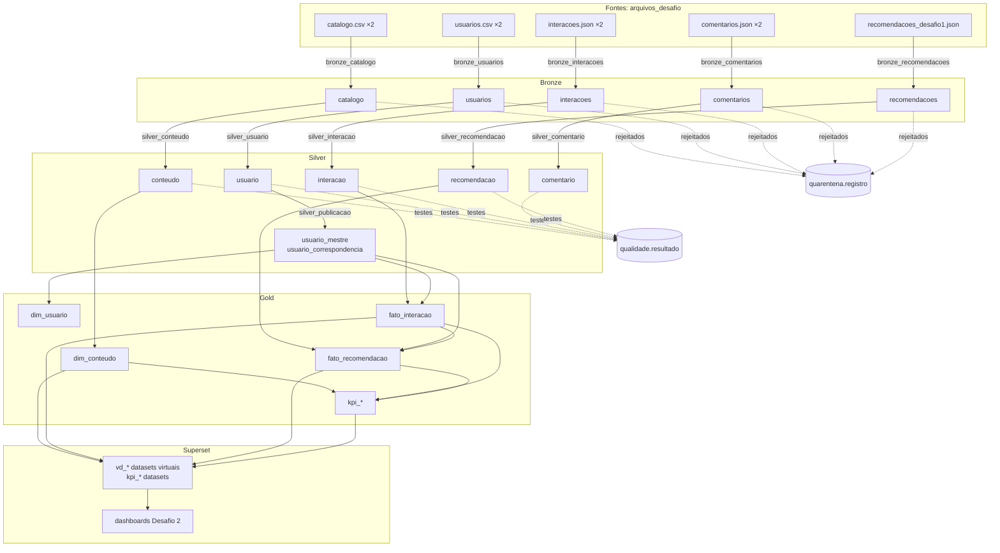

# Linhagem de dados (RF29)

A linhagem está no OpenMetadata e vai da fonte ao dashboard:

> arquivo de origem → Bronze → Silver → Gold → dataset do Superset → dashboard

Uma parte é extraída automaticamente pelos conectores; a outra é registrada pela API, por código ([`openmetadata/provisionar.py`](../openmetadata/provisionar.py)), porque nenhum conector consegue enxergá-la. As capturas estão em [`openmetadata/evidencias/`](../openmetadata/evidencias/):

| Captura | O que mostra |
| --- | --- |
| `05_linhagem_kpi_taxa_conclusao.png` | o KPI com a Silver antes e o dataset virtual e o dashboard depois |
| `06_linhagem_bronze_usuarios.png` | dos dois arquivos de usuários à Silver, aos dados mestres, ao schema restrito, à quarentena e à qualidade |
| `10_dashboard_storytelling_linhagem.png` | o dashboard com os datasets e as tabelas da Gold que o alimentam |
| `11_pipelines_hop.png` | as 13 etapas do Hop registradas como pipelines, que aparecem nas arestas como a transformação |
| `12_linhagem_ponta_a_ponta.png` | **o caminho inteiro de um KPI**: arquivos de origem → Bronze → Silver → Gold → `kpi_taxa_conclusao` → dataset virtual → dashboard (4 níveis a montante e 2 a jusante) |
| `13_linhagem_por_coluna.png` | a linhagem por coluna de `kpi_taxa_conclusao`, com as arestas de `fato_interacao` e `dim_conteudo` até cada coluna do KPI |

## Visão de ponta a ponta



## Principais transformações

Cada aresta registrada pela API carrega uma descrição e a pipeline do Hop que a executa, visível ao clicar na aresta no OpenMetadata.

| De → para | Transformação | Onde está |
| --- | --- | --- |
| arquivo → `bronze.*` | cópia sem transformação, tudo como texto, mais `_execucao_id`, `_origem`, `_linha` e `_ingerido_em` | `hop/pipelines/bronze_*.hpl` |
| `bronze.*` → `silver.*` | tipagem, padronização (datas, domínios, textos), validação de referências, deduplicação, sobrevivência de versões; rejeitados → quarentena | `validacao.classificar_*` em `sql/silver.sql`, `hop/pipelines/silver_*.hpl` |
| `bronze.usuarios` → `silver.usuario` | pseudonimização, hash com salt, mascaramento, faixa etária no lugar do nascimento (RF33) | `lgpd.*` em `sql/camadas.sql` |
| `bronze.comentarios` → `silver.comentario` | anonimização do texto livre | `lgpd.anonimizar_texto` |
| `silver.usuario` → `usuario_mestre`, `usuario_correspondencia`, `restrito.usuario_pseudonimo` | correspondência por `cpf_hash` ou `email_hash`, sobrevivência (RF30) | `silver.publicar()` |
| `silver.*` → `qualidade.resultado` | 8 testes por execução e fonte ou arquivo | `qualidade.executar()` em `sql/qualidade.sql` |
| `silver.*` → `gold.dim_*`, `gold.fato_*` | troca de `usuario_id` pelo pseudônimo da pessoa; `data` e `mes`; conversão da recomendação | `gold.publicar()` em `sql/camada_gold.sql` |
| `gold.fato_*` + `dim_conteudo` → `gold.kpi_*` | agregações por mês, categoria, tipo e nível | `gold.publicar()` |
| `gold.*` → datasets `vd_*` | consultas do SQL Lab (junção, agregação, `CASE`, funções de data) | `sql/sql_lab.sql` |
| datasets → gráficos → dashboard | métricas do dataset (`100 × soma ÷ soma`) | `superset/provisionar.py` |

## Um KPI e um dataset virtual, até a coluna

**KPI `gold.kpi_taxa_conclusao`** (capturas 05 e 13). Além da linhagem entre tabelas, a linhagem por coluna diz de onde vem cada número:

| Coluna do KPI | Vem de | Função |
| --- | --- | --- |
| `pares_consumo` | `fato_interacao.usuario_pseudo`, `conteudo_id`, `tipo_interacao` | `count(DISTINCT (usuario_pseudo, conteudo_id))` com consumo |
| `pares_concluidos` | `fato_interacao.tipo_interacao`, `percentual_conclusao` | `bool_or(tipo_interacao = 'conclusão' OR percentual_conclusao >= 100)` |
| `taxa_conclusao_pct` | as duas acima | `100 * pares_concluidos / pares_consumo` |
| `categoria`, `tipo`, `nivel` | `dim_conteudo` | cópia |

Um nível antes, `silver.interacao` → `gold.fato_interacao` também tem linhagem por coluna (`tipo_interacao`, `percentual_conclusao`, `conteudo_id`).

**Dataset virtual `vd_avaliacao_x_conclusao`**, do SQL Lab (capturas 05 e 10): vem de `gold.kpi_taxa_conclusao` e `gold.kpi_avaliacao` e alimenta o gráfico do quadrante do storytelling. A aresta dataset → dashboard e a aresta tabela → dataset foram extraídas automaticamente pelo conector do Superset, que lê o SQL do dataset virtual.

## Automática × manual

| Relação | Como entrou | Por quê |
| --- | --- | --- |
| tabela da Gold → dataset do Superset (físico ou virtual) | **automática**, ingestão `superset_desafio_metadata` com `dbServicePrefixes` | o conector lê a tabela ou o SQL de cada dataset e casa com as tabelas do serviço `postgres_desafio` |
| dataset → gráfico → dashboard | **automática**, mesma ingestão | metadado do próprio Superset |
| arquivo → Bronze | **manual (API)** | o OpenMetadata não tem conector para arquivos locais; os arquivos são registrados como contêineres de um serviço `CustomStorage` |
| Bronze → Silver → Gold, Gold → KPIs | **manual (API)** | as transformações são funções PL/pgSQL (`INSERT ... SELECT` dentro de `silver.publicar()` e `gold.publicar()`) chamadas pelo Hop. O conector do PostgreSQL extrai linhagem de views e, com o conector de uso, do histórico de consultas (`pg_stat_statements`). Nenhum dos dois vê o que acontece dentro de uma função, e não há conector para o Apache Hop |
| etapas do Hop | **manual (API)**, serviço `CustomPipeline` | mesmo motivo; cada aresta aponta a etapa que a executa |
| linhagem por coluna do KPI | **manual (API)** | não é extraível de dentro das funções |

O registro manual não é um desenho à parte. São arestas reais do catálogo, criadas pelo mesmo script que cria o resto e reaplicadas a cada provisionamento. Se uma tabela for renomeada, o script falha em vez de manter uma aresta para algo que não existe.

## Como localizar a origem de um valor do dashboard

Exemplo: no storytelling, o gráfico **"Segurança & Governança conclui 15% do que começa"** mostra **15,0%**.

1. **Dashboard → dataset.** No OpenMetadata, a linhagem do dashboard (captura 10) mostra que o gráfico usa o dataset virtual `vd_conclusao_coorte`. No Superset, o mesmo aparece em *Edit chart → Dataset*.
2. **Dataset → Gold.** O SQL do dataset está em `sql/sql_lab.sql` (e em *SQL Lab → Saved queries*). Ele lê `gold.fato_interacao` e `gold.dim_conteudo`, e a métrica do gráfico é `100 × SUM(pares_concluidos) ÷ SUM(pares_consumo)`. Para a categoria, isso dá 18 ÷ 120 = 15,0%, os mesmos números de `gold.kpi_taxa_conclusao`:
   ```sql
   SELECT sum(pares_consumo), sum(pares_concluidos) FROM gold.kpi_taxa_conclusao
    WHERE categoria = 'Segurança & Governança';          -- 120 | 18
   ```
3. **Gold → Silver.** A linhagem de `kpi_taxa_conclusao` (capturas 05 e 12) leva a `fato_interacao`, que vem de `silver.interacao` mais a correspondência de pessoas. O `interacao_id` liga a Gold à Silver da mesma execução. Uma das 18 conclusões é a do usuário 78 no conteúdo 683, em 24/09/2026 às 22:11:23.
4. **Silver → Bronze → arquivo.** A Silver guarda `_execucao_id` e `_origem`. Com a chave de negócio (usuário, conteúdo, tipo e data e hora), a Bronze devolve a linha exata do arquivo. O `interacao_id` não serve para isso: é uma chave técnica, gerada de novo a cada publicação da Silver.
   ```sql
   SELECT b._origem, b._linha, b._execucao_id, b._ingerido_em
     FROM silver.interacao s
     JOIN bronze.interacoes b
       ON b._execucao_id = s._execucao_id AND b._origem = s._origem
      AND btrim(b.usuario_id) = s.usuario_id::text AND btrim(b.conteudo_id) = s.conteudo_id::text
      AND b.tipo_interacao = s.tipo_interacao AND b.data_hora::timestamp = s.data_hora
    WHERE s.usuario_id = 78 AND s.conteudo_id = 683 AND s.tipo_interacao = 'conclusão';
   -- dados/brutos/lote_2/interacoes.json | 212 | 943c1278-... | 2026-09-29 03:23:35+00
   ```
   O elemento 212 do array (base 1) é `{"usuario_id": 78, "conteudo_id": 683, "tipo_interacao": "conclusão", "data_hora": "2026-09-24T22:11:23", ...}`.
5. **Execução.** O `_execucao_id` leva a `controle.execucao` e `controle.etapa`: quando a carga rodou, quanto cada etapa leu e gravou e se houve ressalvas. Se o registro tivesse sido corrigido na quarentena, `quarentena.registro` teria as duas versões, a original e a corrigida.

O caminho inverso é a **análise de impacto** do OpenMetadata: a partir de `bronze.interacoes`, mostra tudo o que seria afetado por um problema naquela fonte, até os dashboards.

## Limitações

- A linhagem registrada pela API descreve o que o código faz, mas não é extraída dele. Se `gold.publicar()` passar a ler uma tabela nova, a aresta precisa entrar no script, e o risco é esquecer. Por isso as arestas ficam no mesmo repositório das funções e são revisadas junto.
- A linhagem por coluna cobre só o KPI de exemplo (`kpi_taxa_conclusao`) e a sua entrada (captura 13). As demais arestas são por tabela.
- A comparação `data_hora::timestamp = s.data_hora` no passo 4 depende de a Silver só converter o texto, sem arredondar. É o caso: a validação rejeita formatos que não convertem exatamente.
