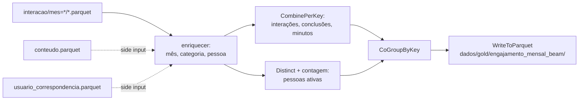

# Parquet e Apache Beam (RF24, RF25)

Parte do Estudante 2. A Silver sai do PostgreSQL para Parquet (RF24), e um pipeline Apache Beam lê esse Parquet e calcula o engajamento mensal por categoria no DirectRunner e num cluster Spark (RF25). O resultado do Beam é conferido, grupo a grupo, contra a mesma regra calculada em SQL na Gold.

Os números abaixo são da execução de referência `943c1278` (29/09/2026, UTC). Cada script regrava a sua evidência ao rodar:

- `beam/evidencias/rf24_medicoes.json`: tamanhos, tempos e tipos lidos.
- `beam/evidencias/rf25_<entrada>_<runner>.json`: volume, tempo, configuração e conferências.

```bash
docker compose run --rm beam beam/exportar_silver.py --volume          # RF24: exporta e mede (Silver e volume)
docker compose run --rm beam beam/pipeline.py --runner direct          # RF25 no DirectRunner
docker compose --profile beam up -d                                    # cluster Spark + job server do Beam
docker compose run --rm beam beam/pipeline.py --runner spark
docker compose run --rm beam beam/pipeline.py --runner spark --entrada volume
docker compose --profile beam stop                                     # libera ~3 GB
```

O volume sintético (200 mil interações, não versionado) é gerado por `docker compose run --rm beam -m ferramentas.gerar_dados --volume 200000`.

## RF24 — Parquet e particionamento

### O que é exportado

`beam/exportar_silver.py` lê a Silver publicada e grava em `dados/silver/`:

| Arquivo | Conteúdo | Linhas |
| --- | --- | --- |
| `interacao/mes=AAAA-MM/*.parquet` | `silver.interacao`, particionada por mês | 1327 em 9 partições |
| `conteudo.parquet` | `silver.conteudo` (dimensão para a categoria) | 1043 |
| `usuario_correspondencia.parquet` | `silver.usuario_correspondencia` (id → pessoa, RF30) | 173 |
| `_manifesto.json` | execução de origem, contagens, partições e esquema | — |

O manifesto registra a execução de origem. A Silver publicada é sempre de uma única execução, porque `silver.publicar()` a troca inteira.

**Esquema, tipos e auditoria preservados.** O esquema Arrow é declarado no código, e não inferido. Os campos de auditoria `_execucao_id`, `_origem` e `_ingerido_em` são mantidos, e os tipos seguem os da Silver:

| Campo | Silver (PostgreSQL) | Parquet | Relido do CSV | Relido do JSON |
| --- | --- | --- | --- | --- |
| `data_hora` | `timestamp` | `timestamp[us]` | `timestamp[ns]` | `timestamp[s]` |
| `percentual_conclusao` | `numeric(5,2)` | `decimal128(5,2)` | `double` | `string` |
| `avaliacao_atribuida` | `smallint` | `int16` | `int64` | `int64` |
| `_ingerido_em` | `timestamptz` | `timestamp[us, tz=UTC]` | `timestamp[ns, tz=UTC]` | `string` |

O Parquet volta com o tipo exato. O CSV e o JSON voltam com o que o leitor consegue inferir: o decimal vira `double` (perde a exatidão) ou `string`, e o instante com fuso vira texto no JSON.

### Estratégia de particionamento: por mês (`mes=AAAA-MM`)

- **As consultas são mensais.** Os KPIs de engajamento e usuários ativos, a série do dashboard e o pipeline Beam agrupam por mês. Com a partição, ler um mês é abrir uma pasta, e as outras nem são lidas (*partition pruning*).
- **Cardinalidade baixa e estável.** A Silver tem 9 meses e o volume sintético tem 20: poucos arquivos por partição, sem o problema de muitos arquivos pequenos. Partir por usuário (171 pessoas) ou por conteúdo (1043) criaria centenas de arquivos de poucos KB.
- **Carga incremental natural.** Um lote novo acrescenta ou substitui só as partições dos meses que tocou.
- **Descartado:** partir por categoria. Cada consulta mensal leria as 8 pastas, e o filtro de categoria já é barato no Parquet, por estatísticas de coluna.

A partição usa o estilo *hive* (`mes=2026-08`), que o pyarrow, o Spark e o Beam reconhecem sem configuração.

### Medições

O mesmo recorte foi gravado em Parquet particionado, CSV e JSON Lines. Cada formato foi lido 7 vezes com o pyarrow 25; a tabela mostra a mediana. A soma de `interacao_id` confere que os três formatos leram exatamente as mesmas linhas. Há duas leituras:

- **Completa:** a tabela inteira.
- **Seletiva:** o mês 2026-08 e 3 colunas (`usuario_id`, `tipo_interacao`, `tempo_consumido`).

**Silver (1327 interações):**

| Formato | Tamanho | Arquivos | Leitura completa | Leitura seletiva |
| --- | --- | --- | --- | --- |
| Parquet | 71,6 KB | 9 | 4,3 ms | 1,5 ms |
| CSV | 225,4 KB | 1 | 7,4 ms | 1,6 ms |
| JSON | 499,4 KB | 1 | 2,4 ms | 2,5 ms |

**Volume sintético (200 mil interações):**

| Formato | Tamanho | Arquivos | Leitura completa | Leitura seletiva |
| --- | --- | --- | --- | --- |
| Parquet | 4,8 MB | 20 | 23,5 ms | **4,2 ms** |
| CSV | 29,2 MB (6× o Parquet) | 1 | 19,7 ms | 18,1 ms (4×) |
| JSON | 69,6 MB (14× o Parquet) | 1 | 53,2 ms | 48,4 ms (11×) |

### Leitura dos resultados

- **Tamanho:** o Parquet é 3 a 14 vezes menor em todos os casos. A compressão por coluna aproveita a repetição de `tipo_interacao`, `_origem` e `_execucao_id`.
- **Leitura seletiva:** é onde o Parquet se paga. Ele lê 1 de 20 partições e 3 de 12 colunas. O CSV e o JSON leem o arquivo inteiro para depois filtrar, por isso a leitura seletiva custa o mesmo que a completa.
- **Leitura completa:** o CSV foi mais rápido que o Parquet. Com 20 arquivos pequenos, abrir cada um e ler os metadados custa mais que o leitor multithread do pyarrow percorrer um único CSV. Ganhar do CSV na leitura completa não é a vantagem do Parquet. As vantagens são o tamanho, a leitura seletiva e os tipos.
- **Na Silver real**, com 1327 linhas, todas as leituras ficam abaixo de 8 ms, e as diferenças de tempo não são significativas: a ordem entre os formatos muda de uma rodada para outra. O volume sintético existe para mostrar a tendência.

### Limitações do experimento

- É uma única máquina, com os arquivos no disco local e o cache do sistema operacional aquecido depois da primeira leitura. Não mede I/O de rede nem armazenamento em nuvem, onde ler menos bytes pesa ainda mais.
- Os tempos variam entre rodadas; a leitura completa do volume em Parquet oscilou entre 20 e 30 ms, e a vantagem na leitura seletiva, entre 4 e 5 vezes sobre o CSV. A mediana de 7 leituras reduz o ruído, mas as comparações valem pela ordem de grandeza, não pelo milissegundo.
- O volume sintético repete a distribuição do lote real. Dados mais variados comprimiriam menos.
- O Parquet usa a compressão padrão do pyarrow (Snappy); não foram comparados codecs nem tamanhos de *row group*.

## RF25 — Apache Beam no DirectRunner e no Spark

### Regra de negócio

`beam/pipeline.py` calcula, **por mês e categoria**:

- interações;
- pessoas ativas: pessoas distintas pelo usuário mestre do RF30, e não ids;
- conclusões;
- minutos consumidos.

A regra é idêntica à de `gold.kpi_engajamento_mensal` (`sql/camada_gold.sql`). É isso que permite conferir o resultado do Beam contra a Gold.



- **`EngajamentoMensal`** é um `PTransform` que recebe as interações e dois *side inputs*: conteúdo → categoria e id → pessoa.
- **`somar`** é associativa. Por isso o `CombinePerKey` pode pré-agregar em cada worker antes do *shuffle*, que é o que torna o pipeline distribuível.
- **Pessoas distintas** usam `Distinct` sobre (chave, pessoa). Uma soma de contagens contaria duas vezes quem aparece em dois workers.
- **Leitura e escrita** são em Parquet (`ReadFromParquet`, `WriteToParquet`).
- **Testes:** `tests/test_beam.py` roda o `PTransform` com `TestPipeline` e `assert_that`, com dois ids da mesma pessoa.

### Configuração dos runtimes

| | DirectRunner | Spark |
| --- | --- | --- |
| Opções (`config.yaml` → `beam.runners`) | `--runner=DirectRunner` | `--runner=PortableRunner --job_endpoint=beam-job-server:8099 --artifact_endpoint=beam-job-server:8098 --environment_type=EXTERNAL --environment_config=localhost:50000` |
| Onde executa | no próprio processo Python do container `beam` | job server do Beam (`apache/beam_spark3_job_server:2.77.0`) traduz o pipeline para um job Spark; Spark 3.5.0 standalone com 1 master e 1 worker (2 cores, 2 GB); o código Python roda no `beam-worker-pool`, ao lado do worker |
| Versões | Beam 2.77.0, Python 3.12 | Beam 2.77.0, Spark 3.5.0 (Scala 2.12, Java 11) |

A configuração efetiva do cluster é lida da API do Spark master no momento da execução e gravada na evidência, sem ser copiada do compose.

### Resultados

| Entrada | Runner | Interações lidas | Grupos (mês × categoria) | Tempo | Igual ao outro runner | Igual à Gold |
| --- | --- | --- | --- | --- | --- | --- |
| Silver | Direct | 1327 | 72 | 0,5 s | sim | **sim (72 de 72)** |
| Silver | Spark | 1327 | 72 | 47,1 s | sim | **sim (72 de 72)** |
| Volume | Direct | 200 000 | 160 | 1,8 s | sim | não se aplica |
| Volume | Spark | 200 000 | 160 | 43,1 s | sim | não se aplica |

A captura [`beam/evidencias/spark_master_aplicacoes.png`](../beam/evidencias/spark_master_aplicacoes.png) mostra a interface do Spark master depois dos dois jobs: 1 worker vivo (2 cores, 2 GB) e as duas aplicações do Beam concluídas (`FINISHED`, 45 s e 42 s).

Conferências automáticas, gravadas em cada evidência:

1. **Contagem:** a soma das interações agregadas é igual ao número de linhas lidas; se não for, o script para.
2. **Runtimes:** o resultado de um runner é comparado linha a linha com o do outro (`igual_ao_direct`, `igual_ao_spark`).
3. **Gold:** na entrada Silver, o resultado é comparado com `gold.kpi_engajamento_mensal` (`igual_a_gold`). A mesma regra, em SQL e em Beam, dá o mesmo número.

### Por que o Spark foi mais lento

O tempo no Spark quase não muda entre 1327 e 200 mil interações: 47,1 s e 43,1 s. Quase todo ele é custo fixo:

- enviar o pipeline ao job server;
- publicar os artefatos;
- subir o job no Spark;
- iniciar os workers Python.

O processamento propriamente dito é uma fração pequena. Com um worker de 2 cores, na mesma máquina e com dados que cabem na memória, o DirectRunner não paga nada disso.

O ganho do Spark aparece quando o volume não cabe numa máquina ou quando há vários workers. O RF25 pede provar que o **mesmo código** roda nos dois runtimes com o mesmo resultado, e não que o cluster seja mais rápido neste volume. A troca de runtime é só a lista de opções em `config.yaml`, sem mudança no pipeline.

### Limitações

- O cluster é uma demonstração: um worker de 2 cores e 2 GB, no mesmo host que os bancos. O Spark não teve paralelismo real a explorar.
- O `beam-worker-pool` compartilha a rede do `spark-worker` (`network_mode: service:spark-worker`), porque o ambiente `EXTERNAL` do Beam espera o worker pool em `localhost`. Com mais workers Spark, cada um precisaria do seu worker pool.
- O Beam lê o Parquet exportado. Se a Silver mudar e a exportação não for refeita, o Beam calcula sobre a versão anterior; nesse caso o `igual_a_gold` falha e denuncia a diferença.
