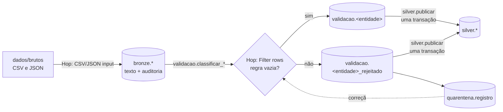

# Apache Hop: Bronze, Silver e orquestração

Parte do Estudante 1: RF20 (Bronze), RF21 (Silver), RF22 (workflow e agendamento) e RF23 (erros, quarentena e reprocessamento), mais a aplicação na Silver dos dados mestres (RF30) e das técnicas de proteção (RF33). Os contratos com as outras partes estão em [`contratos.md`](contratos.md).

## Arquitetura (base para o RF19)

O fluxo é **ELT**:

- **Extração e carga (E, L):** o Hop lê os arquivos e grava tudo como texto na Bronze, sem transformar.
- **Transformação (T):** acontece dentro do PostgreSQL, em SQL versionado (`sql/silver.sql`), e é o Hop que orquestra.



Por que ELT neste projeto:

- **Governança:** a Bronze guarda o dado original de toda execução, então dá para auditar e reprocessar sem reler a fonte.
- **Desempenho:** as regras que cruzam fontes (usuário existe? interação antes da publicação?) são junções que o banco resolve de uma vez, sem trazer as tabelas para a memória do Hop.
- **Reprocessamento:** as regras ficam num lugar só (`validacao.classificar_*`). A Silver e a quarentena nunca divergem, porque a separação entre aprovado e rejeitado sai da mesma consulta.
- **Custo:** um único PostgreSQL faz o armazenamento e a transformação, sem outro motor para operar.

**Limite da solução anterior (Desafio 1):** era um script Python único. Não guardava o dado bruto, não registrava etapas, não tinha quarentena nem reprocessamento, e uma falha no meio deixava os bancos parcialmente atualizados até a próxima execução.

## Arquivos

| Arquivo | Papel |
| --- | --- |
| `hop/workflows/principal.hwf` | Fluxo completo: abre a execução, roda Bronze e Silver, as etapas opcionais (qualidade, gold, metadados) e fecha com o status final |
| `hop/workflows/bronze.hwf` | Confere se as nove fontes existem e ingere uma fonte por etapa |
| `hop/workflows/silver.hwf` | Valida as cinco entidades e publica a Silver |
| `hop/workflows/etapa.hwf` | Executa um pipeline como etapa registrada: início, contagens, status ou falha |
| `hop/workflows/opcional.hwf` | Executa `workflows/<etapa>.hwf` se existir; senão registra a etapa como `ignorada` |
| `hop/workflows/isolado.hwf` | Executa uma camada isoladamente (`FLUXO=bronze` ou `FLUXO=silver`) |
| `hop/workflows/agendado.hwf` | Agendamento nativo do Hop: roda o fluxo completo todo dia às 05:00 UTC (02:00 de Brasília) |
| `hop/pipelines/bronze_<fonte>.hpl` | Lê o arquivo do Desafio 1 e o do lote 2, acrescenta `_execucao_id`, `_origem` e `_linha` e grava em `bronze.<fonte>` |
| `hop/pipelines/silver_<entidade>.hpl` | Classifica, separa aprovados e rejeitados e grava na área de preparo |
| `hop/pipelines/definir_execucao.hpl` | Usa o `EXECUCAO_ID` recebido ou gera um UUID |
| `sql/silver.sql` | Regras de validação, área de preparo, `silver.publicar()` e medição das etapas |
| `sql/camadas.sql` | Tabelas das camadas, quarentena e funções de controle |

## Como executar

```bash
docker compose up -d                                                  # banco e db-init
docker compose run --rm hop workflows/principal.hwf                   # fluxo completo
docker compose run --rm hop workflows/principal.hwf EXECUCAO_ID=<uuid> MODO=manual
docker compose run --rm hop workflows/isolado.hwf FLUXO=bronze        # só a Bronze, execução nova
docker compose run --rm hop workflows/isolado.hwf FLUXO=silver EXECUCAO_ID=<uuid>  # reprocessa a Silver de uma execução
docker compose --profile agendamento up -d                            # agendamento diário (serviço hop-agendador)
docker compose --profile hop up -d                                    # Hop Web: http://localhost:8081/ui
```

O processo termina com código 0 quando a execução acaba em `sucesso` ou `sucesso_com_ressalvas`, e com código diferente de 0 quando acaba em `falha`.

**Uma execução por vez.** A área de preparo (schema `validacao`) é compartilhada entre as execuções. Não rode dois fluxos ao mesmo tempo. Se o `hop-agendador` estiver no ar, evite execuções manuais no horário agendado.

## Acompanhar uma execução

```sql
-- últimas execuções
SELECT execucao_id, fluxo, modo, status, inicio, fim, mensagem FROM controle.execucao ORDER BY inicio DESC LIMIT 5;

-- etapas de uma execução, com contagens
SELECT etapa, status, lidos, gravados, quarentena, duracao_s, mensagem
  FROM controle.etapa WHERE execucao_id = '<uuid>' ORDER BY inicio;
```

Números de referência com os dados de teste (primeira execução completa):

| Etapa | Lidos | Gravados | Quarentena |
| --- | --- | --- | --- |
| bronze_catalogo / usuarios / interacoes / comentarios / recomendacoes | 1050 / 180 / 1416 / 1119 / 1200 | iguais aos lidos | 0 |
| silver_conteudo | 1050 | 1042 | 7 (1 versão do Desafio 1 substituída pelo lote 2) |
| silver_usuario | 180 | 173 | 6 (1 versão substituída) |
| silver_interacao | 1416 | 1326 | 90 (77 do Desafio 1 anteriores à publicação + 13 do lote 2) |
| silver_comentario | 1119 | 1060 | 59 (52 do Desafio 1 + 7 do lote 2) |
| silver_recomendacao | 1200 | 1200 | 0 |
| silver_publicacao | — | 4801 | 162; 173 usuários consolidados em 171 pessoas |

Cada anomalia de `dados/brutos/lote_2/ANOMALIAS.md` cai na regra esperada.

## Quarentena: consultar, corrigir e reprocessar

```sql
-- pendências por fonte e regra
SELECT fonte, regra, count(*) FROM quarentena.registro WHERE status = 'pendente' GROUP BY 1, 2 ORDER BY 1, 2;

-- detalhe
SELECT quarentena_id, fonte, chave_registro, regra, mensagem, registro
  FROM quarentena.registro WHERE status = 'pendente' ORDER BY fonte, linha;

-- corrigir (exemplo L2-C04: carga horária negativa)
UPDATE quarentena.registro
   SET registro = jsonb_set(registro, '{carga_horaria_min}', '"45"'), status = 'corrigido', corrigido_em = now()
 WHERE fonte = 'catalogo' AND chave_registro = '1041';

-- descartar
UPDATE quarentena.registro SET status = 'descartado' WHERE quarentena_id = <id>;
```

Depois da correção, reprocesse a Silver com `workflows/isolado.hwf FLUXO=silver EXECUCAO_ID=<uuid>`, ou espere a próxima execução completa. O registro corrigido entra e fica `reprocessado`. As pendências que dependiam dele também se resolvem: `L2-I13`, a interação no conteúdo 1041, entra na mesma rodada.

## Roteiro de demonstração do RF23

Cada passo foi executado e conferido. Rode os comandos a partir de `desafio_dados/`.

1. **Execução normal com quarentena.** `docker compose run --rm hop workflows/principal.hwf` → código 0, status `sucesso_com_ressalvas`, 162 registros em quarentena com a regra e a mensagem de cada um.
2. **Falha de arquivo (ausente).** Tire temporariamente uma fonte do lugar e rode o fluxo:
   ```bash
   mv dados/brutos/lote_2/comentarios.json /tmp/ && docker compose run --rm hop workflows/principal.hwf; mv /tmp/comentarios.json dados/brutos/lote_2/
   ```
   A verificação `fontes presentes?` falha antes de qualquer carga. A etapa `bronze_fontes` fica `falha`, a execução fica `falha`, o processo sai com código 1 e a Silver anterior continua intacta.
3. **Falha de arquivo (corrompido).** Troque temporariamente uma fonte pelo JSON truncado:
   ```bash
   cp dados/brutos/lote_2/interacoes.json /tmp/ && cp dados/brutos/falhas/interacoes_truncado.json dados/brutos/lote_2/interacoes.json
   docker compose run --rm hop workflows/principal.hwf; cp /tmp/interacoes.json dados/brutos/lote_2/
   ```
   `bronze_interacoes` falha com `Error parsing file`, as etapas seguintes não rodam e a Silver continua intacta.
4. **Falha de regra.** Está no passo 1: registros inválidos vão para a quarentena sem interromper o processamento.
5. **Falha de conexão.** `docker compose stop postgres && docker compose run --rm --no-deps hop workflows/principal.hwf` → o fluxo para na primeira consulta, com erro de conexão no log e código 1. Depois, `docker compose start postgres`.
6. **Correção e reprocessamento.** A seção anterior mostra como: corrija a `L2-C04` e reprocesse. O conteúdo 1041 e a interação `L2-I13` passam a `reprocessado`.
7. **Sem carga parcial.** A publicação é uma transação única. Um erro no meio dela, mesmo depois de a Silver ter sido esvaziada, desfaz tudo. Isso foi testado inserindo na área de preparo uma interação com conteúdo inexistente: a publicação falhou por chave estrangeira e a Silver permaneceu com as mesmas contagens.

## Decisões técnicas

- **Regras em SQL, separação no Hop.** A classificação (`validacao.classificar_*`) é uma consulta por fonte que devolve cada registro com a primeira regra violada. O pipeline Hop separa aprovados e rejeitados com `Filter rows`. Assim, as regras existem num lugar só, ficam testáveis no `psql` e a separação fica visível no Hop.
- **Área de preparo e publicação atômica.** Validar entidade por entidade direto na Silver deixaria a camada inconsistente se a quarta entidade falhasse. Por isso as validações gravam no schema `validacao`, e `silver.publicar()` troca tudo numa transação: Silver, dados mestres, pseudônimos e quarentena.
- **Identidade da quarentena por (fonte, origem, linha, hash).** As fontes são imutáveis e relidas a cada execução. Sem essa identidade, cada execução duplicaria as pendências, e uma correção não teria como substituir o registro original.
- **Verificação das fontes antes da Bronze.** No Hop 2.19, o `JsonInput` acusa "No file(s) specified" ao terminar a lista de arquivos, mesmo quando o arquivo existe, se a opção "não falhar se não houver arquivo" estiver desligada. Com ela ligada, um arquivo ausente passa em silêncio. Por isso a opção fica ligada, e a action nativa `Check if files exist` (`FILES_EXIST`) garante a pré-condição antes de qualquer carga.
- **Segredos.** A chave de pseudonimização e o salt chegam às consultas como variáveis do Hop geradas do `.env` (`docker/hop/segredos.sh`). Valor vazio, curto ou de exemplo interrompe a etapa com mensagem clara.
- **Agendamento nativo.** A action Start do Hop repete o workflow diariamente, no serviço `hop-agendador`. O horário está em UTC para que execuções manuais e agendadas usem o mesmo fuso nas regras de data.

## Limitações conhecidas

- **CSV lido por posição.** O `CSV file input` do Hop ignora os nomes do cabeçalho. Um arquivo sem uma coluna (`dados/brutos/falhas/catalogo_sem_coluna_categoria.csv`) não para a Bronze: os valores se deslocam e a Silver manda as linhas para a quarentena por domínio inválido. O problema aparece, mas como quarentena em massa, não como falha de arquivo.
- **Banco caindo no meio de uma execução.** A execução fica `em_andamento`, porque não há como registrar a falha. Ao reprocessar essa execução, `finalizar_execucao` a conclui como `falha` enquanto houver etapa nesse estado.
- **Arquivo ausente não é nomeado no log.** A action `FILES_EXIST` só nomeia o arquivo que falta no nível de log Detailed. A mensagem da etapa lista as fontes a conferir.
