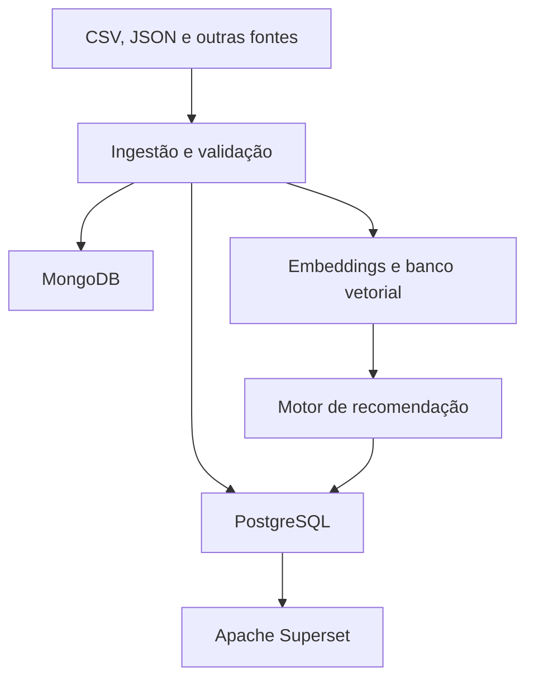

# 8. Arquitetura mínima esperada

| Etapa                  | Tecnologia ou resultado                                         |
| ---------------------- | --------------------------------------------------------------- |
| Fontes                 | CSV, JSON                                                       |
| Ingestão               | Leitura, validação, limpeza e registro de erros.                |
| Dados estruturados     | PostgreSQL.                                                     |
| Dados semiestruturados | MongoDB.                                                        |
| Dados vetoriais        | pgvector.                                                       |
| Processamento          | Busca semântica e motor de recomendação.                        |
| Apresentação           | Apache Superset conectado aos dados consolidados no PostgreSQL. |

A Figura 1 é uma representação gráfica da arquitetura mínima esperada para a solução do desafio.

_Figura 1. Representação gráfica da arquitetura._

# 9. Práticas de DataOps

A solução deverá apresentar práticas básicas de DataOps:

- código organizado em diretórios;
- arquivo README.md;
- dependências registradas;
- parâmetros de conexão separados do código;
- registro das etapas executadas;
- tratamento básico de erros;
- instruções para reproduzir a solução;
- controle de versão, quando possível.

# 10. Uso da Inteligência Artificial

A IA poderá ser utilizada para explicar erros, sugerir comandos SQL, auxiliar na modelagem, produzir expressões regulares, propor tratamentos para dados ausentes, revisar código, sugerir métricas, apoiar a geração de embeddings e melhorar a documentação.

A equipe continuará responsável por testar, compreender e justificar tudo o que entregar. Como parte da documentação, deverá apresentar um pequeno registro contendo:

- ferramenta de IA utilizada;
- exemplos de solicitações realizadas;
- trechos ou decisões apoiadas pela IA;
- erros ou inadequações encontrados nas respostas;
- alterações feitas pela equipe.
