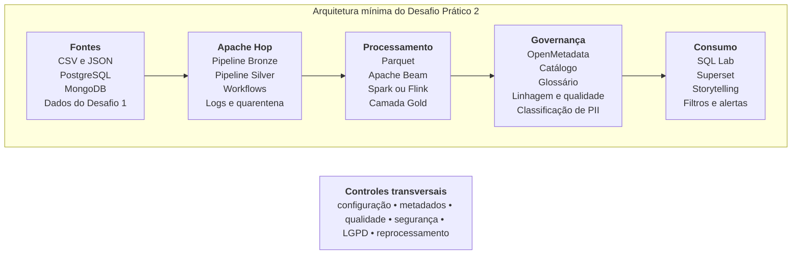

# 8. Arquitetura mínima esperada

A Figura 1 apresenta uma referência para a arquitetura mínima. A equipe poderá adaptar tecnologias e disposição dos componentes, desde que preserve as responsabilidades das camadas e justifique as alterações.

_Figura 1. Representação gráfica da arquitetura mínima do Desafio Prático 2._

| Camada ou componente      | Responsabilidade mínima                                                  |
| ------------------------- | ------------------------------------------------------------------------ |
| Fontes                    | Arquivos e bancos produzidos no Desafio 1.                               |
| Bronze                    | Cópia auditável dos dados ingeridos, sem transformações destrutivas.     |
| Silver                    | Dados padronizados, validados, deduplicados e separados da quarentena.   |
| Gold                      | Tabelas e visões orientadas aos KPIs e às perguntas de negócio.          |
| Processamento distribuído | Pipeline Apache Beam executado com DirectRunner e Spark                  |
| Governança                | Catálogo, glossário, classificações, linhagem, qualidade e responsáveis. |
| Consumo                   | SQL Lab, datasets virtuais, dashboard, storytelling, filtros e alertas.  |

> **Segurança:** credenciais, salts, chaves, dados pessoais originais e tabelas de correspondência não deverão ser incluídos no repositório nem expostos no dashboard.

# 9. Governança, DataOps e proteção de dados

A solução deverá integrar práticas de operação, governança e segurança ao fluxo, e não tratá-las apenas como documentação final. No mínimo, a equipe deverá:

- versionar código, pipelines, workflows, consultas e configurações não sensíveis;
- usar parâmetros por ambiente e registrar dependências;
- manter logs correlacionados por identificador de execução;
- documentar responsáveis pelos ativos e termos de negócio;
- registrar critérios de qualidade e ações diante de violações;
- aplicar o princípio da minimização de dados pessoais;
- definir rotina de recuperação e reprocessamento;
- fornecer instruções para reproduzir a solução.

# 10. Uso da Inteligência Artificial

A IA poderá ser utilizada para explicar erros, sugerir transformações do Apache Hop, revisar consultas SQL, propor testes de qualidade, auxiliar na documentação de metadados, revisar regras de anonimização, apoiar a interpretação de resultados e melhorar a comunicação do storytelling.
